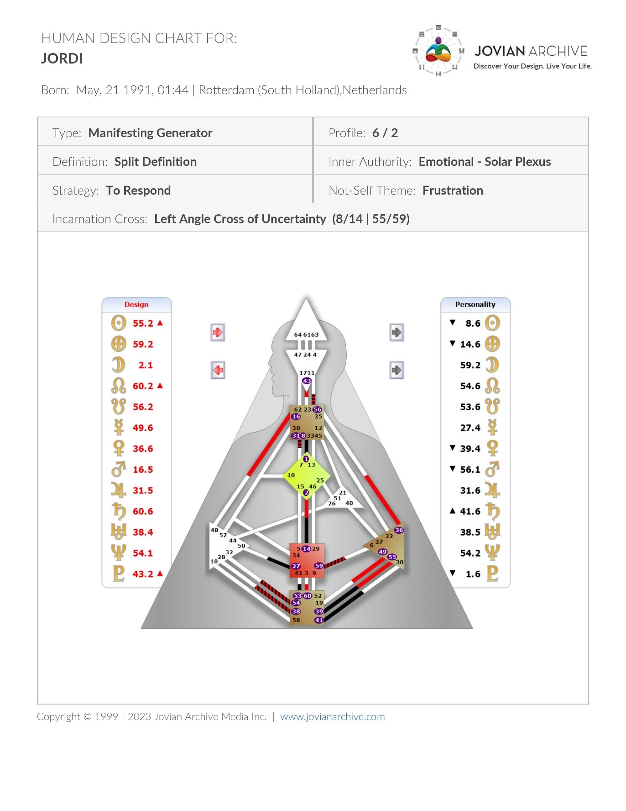

Dit wordt waarschijnlijk een van mijn favoriete blogs. Ik ga namelijk vertellen over mijn 2e moeder, Debbie Bergmann. Het is de persoon in mijn leven die ervoor zorgt dat ik spiritueel het meeste groei. Ook kan ik met haar op hetzelfde spirituele niveau praten. Iets met wat ik maar met weinige kan.

## Hoe ben ik bij Debbie gekomen?

Nou, dat is eigenlijk wel een mooie. Via een vriend van mij genaamd Michel.

Het is al even geleden maar ik weet nog wel dat wij in het bubbelbad zaten van Zwembad Olympia in Waalwijk. Wij hadden het over mijn ziekte van Lyme, spiritualiteit en hooggevoeligheid. Ook hadden wij het over iemand die Michel kent. Die is net als mij spiritueel. Michel zei het nog mooi, een Jordi maar dan een vrouw. Dat moet dan wel een klasse vrouw zijn 😉.

Dus vervolgens een afspraak gemaakt bij Tian Tang, de praktijk van Debbie.

De afspraak was voor Lyme, om te kijken of zij iets kon betekenen. Het was al wel stabiel maar ik was toen nog zoekende om mijn gezondheid te verbeteren. Wij kunnen het natuurlijk altijd proberen. Omdat het over Lyme ging had ik de afspraak bij Debbie.

Vrijdag 10 januari 2020 was de ontmoeting met Debbie.

De dag was aangebroken om als klein lief manneke naar praktijk Tian Tang te gaan. Ik vertelde over mijn lyme en ze gaf daarover advies. Wij hadden het ook over Guasha en Iriscopie. Mijn hooggevoeligheid werd ook kort aanstipt in het gesprek.

Een eerste indruk had ik niet echt van Debbie. Wel weet ik dat zij meteen wilde doorpakken. Ik vond het allemaal prima en was vooral benieuwd.

Einde sessie werden de afspraken gemaakt voor Guasha en Iriscopie. Guasha was bij Vanessa en Iriscopie bij Debbie zelf.
Voor de mensen die het nog niet weten, zoals ik zelf eerst, iriscopie is een diagnosemiddel waarbij naar de ogen wordt gekeken voor de algemene gezondheid.

Debbie kan daarmee heel veel zien. Ze wordt dan zelfs een beetje eng. Een beetje heel eng.

Echt van WTF, waar is de persoonlijke ruimte…? Halloo….?!? XD

Het ging namelijk als volgt: Debbie was in mijn ogen aan het kijken en zei dat ze duidelijk kan zien dat ik hooggevoelig ben. Verder zal ze me vast meer hebben uitgelegd maar dat kan ik mij niet meer herinneren. Wat ik me nog wel HEEL DUIDELIJK HERINNER IS HET VOLGENDE, hahaha. Ze had dus net in mijn ogen gekeken en maakte zich ineens groot en ging met haar gezicht heel dicht bij mij hangen. Ze keek mij recht aan en zei: “Jij bent van de controle. Er zit nog zoveel in jou dan dat eruit komt. Je maakt jezelf kleiner dan je bent. Je bent ook intelligent en van het manipuleren”. Mijn reactie was natuurlijk van “euhhhhhhh, okéee”. Die zag ik niet aankomen. Vooral bij controle dacht ik van “euhh, jij bent de eerste ooit die het zegt”. Bij manipuleren reageerde ik wel verbaast met de vraag “Manipuleren…??”. Waarop Debbie zei “Ja onbewust”. Vooral die laatste vergeet ik nooit. Zelfs bij het schrijven vind ik die hilarisch. Probeer hem ook altijd toe te passen bij andere. Als ze dan weerwoord hebben bij een mening over hun eigenschappen zeg ik “Deze is van Debbie: Ja, onbewust”. Wel moet erbij gezegd worden dat ze gelijk heeft. Ze is alleen schattig vergeten.

Zie hier dus een van de eerste momenten met mijn 2e moeder. Het blijft mooi om aan terug te denken en wordt met de dag nostalgischer.

## Wat hebben wij tot nu toe gedaan

Veul zoals ze in Brabant zeggen.

Wij begonnen met het behandelen van mijn echte hulpvraag.

De lyme was namelijk niet mijn echte vraag. Dat wist ik toen eigenlijk ook wel, maar vooral onbewust.
Nadat ik eerst uit schaamte het traject bij haar niet wilde beginnen ben ik na mijn ex het traject wel begonnen.
Ik weet ook nog dat zij het ook jammer vond dat ik de 1e keer al niet het traject aanging. Ik zag haar verdriet. Bij de 2e kans was ze ook dwingender. Op een goede manier, zoals een moeder haar kroos wilt beschermen. Ik vond het toen al grappig.

### De echte hulpvraag
De echte hulpvraag was trouwens om van mijn angst voor agressie/confrontatie af te komen. Elke keer als iemand namelijk agressief of lelijk tegen mij was kon ik niet terugslaan. Het was alsof er een visnet om mij heen werd gespannen. Ik wist dat er iets achter zat maar niet meer wat. Nu weet ik wat maar dat komt allemaal in mijn boek.

### Wat wij als eerste hebben gedaan: Progessive Mental Alignment

Wij zijn daarom ook begonnen met PMA [(Progressive Mental Alignment)](https://www.pmainstitute.nl/).

PMA is een manier om van trauma af te komen. Het zorgt ervoor dat de corrupte bestanden in je hoofd weer geformatteerd worden en alles weer helder is van een gebeurtenis. Bij hevige angst krijgt je brein namelijk kortsluiting. Dit is vaak om jezelf te beschermen. Je weet dan bijvoorbeeld niet meer dat je uit een brandende auto bent gestapt, maar vervolgens heb je wel altijd een naar gevoel bij een barbecue. Je weet niet waarom, want het geheugen voor de reden waarom is niet meer vindbaar. De pijn blijft dan in je lichaam en dat heeft natuurlijk nare gevolgen.

Iedereen van ons heeft wel zulke ervaringen en wij hebben er last van zonder dat wij het weten. Vooral de mensen die hooggevoelig zijn.

Bij de PMA werd mij geleerd om mijn gevoel waar te nemen, het gevoel van mijn lichaam, dus niet de interpretatie ervan. Dus voelde ik steken bij het zien of horen etc. van een bepaald iets of wat dan ook dan moest ik het daarbij laten en niet aangeven dat ik mij geïrriteerd voelde. Dat is namelijk interpretatie. Ik moest vervolgens ook een boekje bijhouden en de gebeurtenissen en sensaties opschrijven. Als ik het zo opschrijf komt het goed overeen met Reiki voor mij vandaag de dag. Het is voor mij dan ook dé manier om jezelf te reinigen. Ik raad Reiki en PMA bij deze dan ook iedereen aan.

### Het mooie Human Design

Vervolgens zijn wij begonnen met Human Design.

Ik kende het nog niet maar liet mij graag verrassen.

Human Design is jouw “blauwdruk” voor dit leven en is een holistisch zelfkennissysteem. Daarbij is je geboortedatum en tijd belangrijk. Als je vervolgens naar de website van humandesign.nl gaat kun je je gratis chart aanvragen.

Een Human Design chart ziet er als volgt uit:

Dit is die van mij. Let er wel op dat die van jou er helemaal anders uit kan zien. Er is ook geen goed of fout. Het is alleen anders.

Als je inhoudelijke vragen hebt over je chart kun je altijd met mij contact opnemen.

Een van de eerste dingen die zij vertelde is dat ik een oude ziel heb. Mooi om te horen natuurlijk, verbaast was ik enkel niet. Wordt wel vaker als een oude ziel gezien. Dit schijnt te maken te hebben met het aantal volledige open centrums.
Verder zijn wij maandelijks de centrums afgegaan en gekeken naar de gave en valkuilen voor dat centrum plus bijbehorende poorten (thema’s). Het is ook nog belangrijk erbij te zetten dat verbanden (zien) belangrijk is bij Human Design. Het ene kan namelijk het andere versterken of dwarsbomen.

Heel interessant allemaal.

Tijdens het Human Design traject ben ik erachter gekomen dat ik mijn gevoel moet volgen bij elk besluit. Ik moet er ook een nachtje over slapen en mag nooit in het moment een keuze maken.

Tijdens het Human Design traject ben ik ook gewoon verder gegaan met de leerlessen van PMA en ben ik erachter gekomen wat mij allemaal dwarszat. Human Design heeft mij dan ook verder geholpen met de echte ik worden. Het laat zo duidelijk zien hoe je in elkaar zit en wat je nodig hebt.

Vooral dat laatste is handig. Je hebt eindelijk een taal en kunt zo nog helderder communiceren en weten wat je écht nodig hebt. Dat is het geschenk wat Human Design je geeft.

Dus ook deze in voor iedereen zeer aan te raden.

## Waar wij op dit moment mee bezig zijn

Met belangrijke zaken natuurlijk :P.

Op dit moment zijn wij bezig met Gene Keys.

Gene Keys gaat verder op Human Design. De focus ligt vooral op de poorten en gaat heel diep. Het gouden pad hebben wij net bij mij afgerond en bestaat voor iedereen uit zijn levenswerk, evolutie, uitstraling en doel.

Het levenswerk is zelf zeggend en gaat over wat iemand hier te doen heeft en op welke manier hij naar buiten treedt. De evolutie is hetgeen wat weer daaronder zit. Wat moet evolueren, wat heeft iemand te leren, om vervolgens de levenswerk ten volste aan te wakkeren. Het levenswerk is dan ook de zon en de evolutie de aarde, beide zijn nodig en zijn elkaars programmeer maatje. Ze versterken elkaar, ten goede of ten kwade.

Bij mij is mijn levenswerk Gene Key 8, de rebel (iets wat niemand om mij heen verbaast en mijzelf al helemaal niet). Ik hoor dus ook daadwerkelijk met een doel om mij heen te schoppen. Het is dan ook een van mijn passies! Mijn evolutie is Gene Key 14, de krachtpatser. Ook deze verbaasde mij niet. Enthousiasme is een van zijn voornamelijk kenmerken. Ook uit deze Gene Keys blijkt dat ik echt iets moet doen waar ik achtersta en nooit de meute moet volgen. Mooi dat Gene Keys gewoon de realiteit is. Ik hoor namelijk echt geen loonslaaf te zijn en iets te doen wat ik leuk vind.

Vervolgens is er de doorbraak en gaat men verder naar het onbewuste.

Hier komen wij bij de uitstraling en iemand zijn doel.

De uitstraling geeft aan hoe iemand gezond kan zijn. Als je bij deze in je schaduw zit voel je het gewoon aan je lichaam en vreet het aan je. Dit is/was bij mij het geval. Ik weet ook toen wij begonnen dat ik intuïtief meer van dit bolletje wilde weten. Dit bolletje heeft/had namelijk het meeste aandacht nodig. Iemand zijn doel geeft aan wat iemand ten diepste vervult. Dit kan een maatschappelijk doel zijn of een individueel doel, niets is goed of fout. Vaak heeft het doel ook meerdere lagen waardoor het vaak toch wel individueel en universeel is. Heel mooi. Voor mij bevestigde het doel weer dat Reiki echt iets is wat ik hoor te doen en vooral ook op mijzelf dien te gebruiken. Maar dit kan natuurlijk voor iedereen anders zijn. Ook dit tweetal is programmeerpartner van elkaar. Dus ja, hoe beter je in de ene zit hoe beter je in de ander zit.

Voor mij is de uitstraling Gene Keys 55, de spelwisselaar, en Gene Keys 59, de speelkameraad. Deze hebben als thema vrijheid en intimiteit. Deze vrijheid komt door leeg te zijn en alles los te laten. Ook is het voor mij belangrijk om bij deze twee Gene Keys intiem met mijzelf te zijn. Door de echte Jordi te zijn en alles te laten waaien komt het goed. Nergens meer aan vastbijten en het ego moet dood. Daar zijn wij dan ook mee bezig.

In mijn optiek zijn ze allemaal belangrijk, maar zelf vind ik de uitstraling en doel de focus. Ze staan namelijk voor het onbewuste. Dus hoe beter dat bij je zit hoe beter het bewuste gaat, dat is gewoon zo. Wellicht dat ik het later anders zie, maar zo zie ik het nu.

Wel even een tip tussendoor. Gene Keys kan af en toe een beetje theatraal zijn en megalomane woorden gebruiken. Zelf heb ik dan ook steeds meer de teksten gelezen met een gezond korreltje zout. Ook leer ik steeds meer dat ik ben wie ik ben en dat niet laat bepalen door iemand, ook niet door Debbie die er af en toe doorheen blaft. Die blaft maar 😉.

Laat de teksten dan ook vooral mijmeren in jezelf met gevoel. Het is ook belangrijk om de schaduwen te accepteren, nogmaals, wel op eigen voorwaarden en niet die van een andere. Het mag er allemaal zijn.

Nadat wij het gouden pad hebben gelopen zijn wij doorgegaan naar de venusreeks. Dit is de reeds die begint bij je doel en het doel van je doel. Relaties staan hierbij centraal en vrouwelijke energie. Deze reeds kun je dan ook NOOIT overhaasten. Het komt wanneer het komt en wordt met andere bewandelt.

Hier zijn wij net begonnen en kan maar wil ik vooral ook niet te veel over zeggen.

Het enige wat ik kwijt wil is dat ik in de startfase zit om een diepere relatie te krijgen met de mensen om mij heen en hun geschenk aan mij in ontvangst te nemen. Ze zijn namelijk in mijn leven om mij iets te geven/te leren. Ik weet al wat, maar nu nog even doorpakken. Drukte van het leven komt er namelijk soms tussen.

Net als bij iedereen wel.

Wordt vervolgd….

## Wat wij samen gaan doen

Toetoettoettttttoeeeeeee!!

Wij gaan samenwerken!

Niet zo maar, maar wij gaan een community oprichten. Wij willen namelijk om spirituele redenen een community. Debbie wilt mensen hoger laten transcenderen en ik wil weten, voelen en vooral ervaren hoe andere omgaan met hun Human Design en Gene Keys. Dit wil ik in mij opnemen en gebruiken voor mijn boek en in mijn leven. Het zal mij helpen. Dat weet ik gewoon. Ik zal er zeker van groeien.

## Mijn gevoel bij Debbie

Dat is heel positief 😊. Dat had jij natuurlijk nooit verwacht.

Het fijnste van Debbie vind ik haar moederlijke liefde. Zij is er echt voor je en denkt niet alleen met je mee maar voelt vooral ook met je mee. Ze probeert ook op een goede manier je wakker te schudden. Dat is niet altijd fijn. Ze is ook niet altijd juist maar dat maakt niet uit. Haar intenties zijn ALTIJD zuiver.

Het is zelfs zo mooi dat zij de 1e vrouw en 2e persoon in mijn leven is waar ik ontzag voor heb. Dat heb ik eigenlijk nooit. Diegene voor haar is mijn vader. De rest is eigenlijk nooit eens in de buurt gekomen. Voor mij is dat nogal wat, ik heb namelijk niet snel dat ik naar iemand opkijk. Toch heb ik wel ontzag voor Debbie. Het mooie eraan is ook dat het vooral een gevoel is wat ik ook een zuiver gevoel wil laten en niet wil verklaren of uitleggen. Het is gewoon mooi.

Ze is ook de 1e persoon die er echt helemaal voor mij is en kan zijn, die zwaarte kan niet iedereen dragen.

Debbie is een mooi mens en verdient de eeuwige liefde.

p.s. Haar hondje Brutus is echt een scheetje.

Als dit je nou aanspreekt of je hebt er vragen over dan kun je altijd contact met mij opzoeken. Er kan geappt worden naar +31 6 39556179 of gemaild worden naar info@dekernmetjordi.com.

Ook kun je natuurlijk een afspraak maken, spreek je mij meteen 😜.

<a
              class="small-caps block mb-4 py-4 text-lg text-center font-medium leading-normal rounded gradient-btn no-underline"
              href="https://calendar.app.google/oHow2Z6mhSpUVwQUA"
              >Maak een afspraak</a
            >

## Wat andere ook lezen
<ul>
  <li>
    <a class="text-lg font-medium underline text-brand-copper hover:no-underline" href=../../de-manieren>De manieren
    </a>
  </li>
  <li>
    <a class="text-lg font-medium underline text-brand-copper hover:no-underline" href=../../reiki/wat-is-reiki/>Wat is Reiki
    </a>
  </li>
</ul>