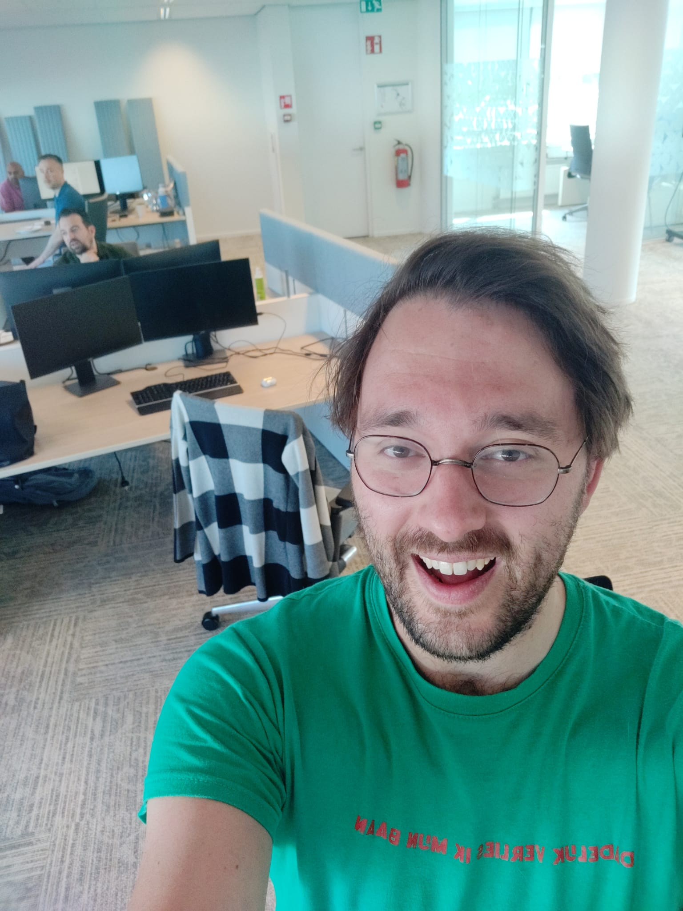
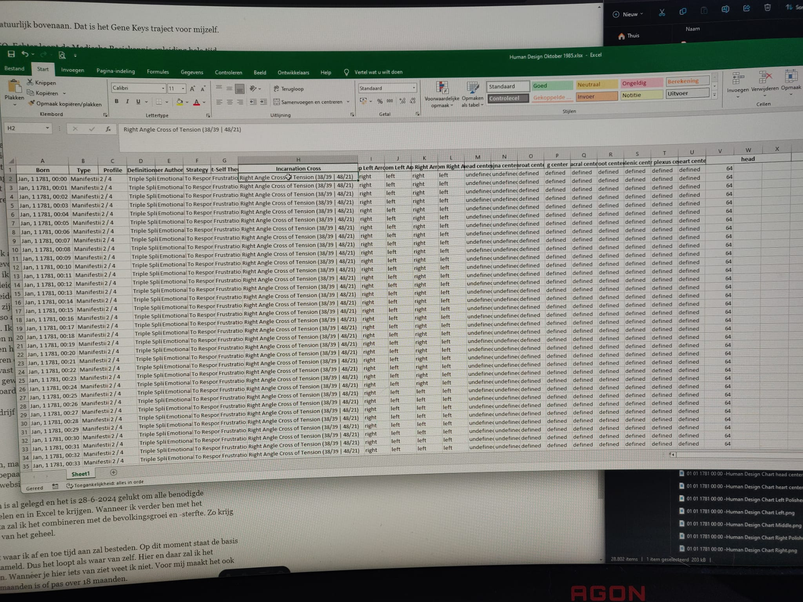

Zoals je kan lezen in de titel en sommige van jullie al weten heb ik mijn baan opgezegd. Nog met veel plezier ook 😃. Was wel even spannend natuurlijk, want ja, ineens valt je vaste salaris weg en kom je nog niet rond met de inkomsten uit de praktijk. Maar toch heb ik mijn gevoel gevolgd en daar gaat het om. Dan komt het sowieso goed. Ik heb gevoel gekozen boven angst.

## Even wat vooraf ging?

Eerst was het idee om minder te gaan werken. Dus van 36 uur naar 32 uur en dan de ene week 4 dagen en de andere 3 dagen en meer werken in die 3 dagen. Dat heb ik ook gedaan.

Dit was enkel niet voldoende, dus wilde ik meer, meer, méér tijd voor de praktijk en wat écht van belang was.
De carrière-switchregeling heeft al vaker gelonkt maar dit keer zijn wij er gretig mee aan de slag gegaan.

De regeling houd in dat iemand de afspraak maakt met de ABN-AMRO (vorige werkgever) om 50% te gaan werken voor een voor afgesproken periode (maximaal voor 2 jaar). Waarna bij verloop van de periode het contract beëindigd wordt en de werknemer nooit meer voor de ABN-AMRO of zijn dochterondernemingen mag werken. Je krijgt dan wel naarmate je tijd bij de ABN-AMRO tijdens deze periode een vergoeding voor de uren die je niet werkt. Voor mij zou dat 10% zijn. Dus bij 50% werken zou ik 60% uitbetaling krijgen. Mooi meegenomen toch.

Het liep toch anders…

Maarja, dat hoorde ook. Zo zou ik het meeste groeien, hetgeen wat het belangrijkste is.

Het toeval wilde dat mijn oude manager wegging. Wij kregen een nieuwe manager die toch zaken anders aanpakte.
Na 2/3 maanden had ik nog geen antwoord en werd het werk steeds ondragelijker. Ik vond het gewoon echt niet meer leuk. 
Tijdens een rustperiode heb ik alles laten bezinken en kwam ik intuïtief (altijd mijn gouden momenten) op het internet uit op de vaststellingsovereenkomst.

Het is namelijk tijd om te gaan. 

Het voelde goed om ook weg te gaan. Iets wat ik al veel langer weet, maar ik wilde het pragmatisch en stapsgewijs doen. Iets wat mijn ziel blijkbaar niet wilde 😜.

Dus tijdens de rustperiode hebben wij gesproken met de manager over een vaststellingsovereenkomst. Hij had het begrepen en zal het doorgeven naar boven en HR.

Toen ik vervolgens weer aan het werk was kwam er maar geen antwoord. Ook niet toen ik op hun verzoek een lange mail met uitleg heb geschreven over waar om ik een vaststellingsovereenkomst wilde. Ze wilde namelijk niet van mij af.
Ik echter wel.

Weken gingen voorbij zonder iets te horen. 

Het werd wel langzaam mei…

Toen ging ik weer contact zoeken met mijn diepste zelf. Met kleine Jordi, hetgeen wat mijn puurste zelf is. Klinkt heel zweverig, maar het is wel de waarheid. Het is gewoon zo. Hij gaf aan dat alles goed zit. Als ik ontslag zal nemen zal het allemaal veel sneller gaan. De klanten zullen echt komen. Zeker als ik ontslag neem. Ze zullen alleen enkel ineens komen en op een hele gekken manier. Ik geloofde mijn gevoel en mijn puurste zelf. Het was wel even spannend, maar wij hebben gewoon de hand geschud. De afspraak was dat ik sowieso mijn baan zou opzeggen als ik eind mei nog geen antwoord heb gekregen. 

Gelijk heeft die. Laat mij niet gijzelen door die lijers.

Mijn omgeving had echter wel moeite met het besluit. Vrienden, familie etc. Je ziet op zulke momenten dat heel veel mensen in angst leven en veel te veel hun angst laten regeren over hun leven. Ze willen allemaal te veel zekerheid, veelte veel, niet normaal. Echt zonden, maar dat hield mij niet tegen. Je bent een rebel of niet.

Vervolgens kreeg ik te horen dat alles bij Legal ligt en dat zij er nog een klap op moeten geven. Lekker dan. Eerst wachten op de manager en zijn manager en vervolgens op een team waar ik helemaal geen contact mee heb.
Het was echter wel eind mei.

Volgens mij voel jij hem nu ook al aankomen XD.

Het was op een gegeven moment zelfs 31 mei.

Met de stoute schoenen aan logde ik in. Normaal werk ik namelijk niet op een vrijdag. Ik typte naar mijn manager dat het dringend was. Hij zat namelijk in een call.

Hij belde terug toen ik op de wc zat. Zo het altijd gaat.

Een van de eerste zaken die ik vroeg was natuurlijk of hij iets had gehoord van Legal. Hij zei ligt oriënterend nee.
Dat had ik natuurlijk verwacht.

Vervolgens zei ik met ontzettende blijheid dat ik dan bij deze mijn baan opzeg. Het was de weken daarvoor af en toe spannend maar niet in het moment. Het gesprek met de manager ging heel goed. Hij is en was ook trots op mij. 

Wij waren het beide met het volgende eens:

> In afwezigheid van zekerheid kan men de grootste vruchten plukken van groei

Ik wens ze bij de ABN-AMRO het beste.

Voor de mensen die het niet kunnen lezen. Op het t-shirt staat "Dadelijk verlies ik mijn baan".

Je bent een rebel of niet.

## Toekomstmuziek

Nou ik natuurlijk 100% kan gaan voor mijn passie en jullie zijn er fraaie plannen op komst.

Hier even een opsomming met de zaken waarmee ik bezig ben:
1.	Gene Keys traject voor mijzelf;
2.	Medische Basiskennis;
3.	SEO;
4.	Podcast serie: Het innerlijk kind; 
5.	Data verzamelen van Human Design;
6.	Google Review op website zetten.

Een mooie lijst hè.

Het allerbelangrijkste staat natuurlijk bovenaan. Dat is het Gene Keys traject voor mijzelf.

Vervolgens is dat eigenlijk SEO. Echter loopt de Medische Basiskennis opleiding hele tijd om aandacht te roepen… Het gaat daar ontzettend goed mee en ik heb het praktisch gedeelte al gehaald. De toetsen die nog komen zullen net als de andere toetsen goedgaan. Echter wil ik het liefste bezig zijn met SEO, de podcast en data verzamelen van Human Design (verdere uitleg volgt hieronder). Maarja, het loopt t/m november en dan zijn wij ervan bevrijd.

Over SEO. 

Dat wil ik het liefste uitbesteden voor een paar honderd euro per maand. Het kan wel zelf, maar dat zal mij te veel afleiden van de andere projecten binnen het grote project De kern met Jordi. De eerste contacten met marketing bureaus zijn al gelegd. Zal wel eerst even hier en daar een landingspagina maken, maar als die klaar zijn kan het als het goed is beginnen. Daarom heeft dit even de hoogste prioriteit na Gene Keys omdat dan de bal kan gaan rollen en vooral anderen het werk zullen doen. Het is gewoon onmisbaar om niet hoog in Google te staan. 

Dat is een feit.

Op dit moment zijn wij ook al de 1e podcast aflevering met Karin aan het bewerken. Wij zijn daar ook al heel ver gevorderd. Enkel komen andere zaken hoger op de prioriteitenlijst. Wanneer ik even vrij ben van het Gene Keys traject (wat veel lezen is), de Medische Basiskennis opleiding (wat ook veel lezen is) en SEO (waarvoor ik nog even zaken moet voor voorbereiden) zal ik weer met plezier werken aan de afleveringen. De eerste serie zal spannend zijn om online te gooien maar daarna zullen er nog vele volgen. Via de mail krijg je sowieso als eerste toegang tot de podcast afleveringen.

Daarnaast is er nog een nieuw wapenfeit. Ik kan hier niet in detail treden hoe ik hier te werk ga, maar het wordt heeeeel leuk. Ik ben namelijk data aan het verzamelen van Human Design en dan met name door de eeuwen heen. Van 1850 t/m 1900 hoeveel procent werd toen geboren als Generator en wat waren de top 5 incarnation cross daarbij? Ik wil het gewoon weten en delen met jullie. Dit zal vast unieke inzichten geven en echt wel te rijmen zijn met de geschiedenis. Ook wil ik gewoon weten wat het design was van Bob Marley en Anne Frank. Met mijn data en dashboard zullen wij dat vast wel heel erg dicht kunnen benaderen. 

Ook is het voor mijn bedrijf een sterke keuze. Zo heb ik unieke content wat nog nergens te vinden is.

Het wordt geweldig. 

Vet hè. Het zijn rije van kostbare data. 

De vorm staat nog open, maar dat komt wel goed. Het voelt op dit moment goed om er een boek van te maken en bepaalde stukken te delen via de nieuwsbrief. Wellicht ooit ook een aparte pagina op mijn website waar je de data in kan zien via een dashboard. Wie weet. 

Het beginwerk hiervan is al gelegd en het is 28-6-2024 gelukt om alle benodigde datapunten te verzamelen en in Excel te krijgen. Wanneer ik verder ben met het verzamelen van de data zal ik het combineren met de bevolkingsgroei en -sterfte. Zo krijg je een nog beter beeld van het geheel. 

Dit is een lang project waar ik af en toe tijd aan zal besteden. Op dit moment staat de basis en wordt de data verzameld. Dus het loopt als waar van zelf. Hier en daar zal ik het proberen te versnellen. Wanneer je hier iets van ziet weet ik niet. Voor mij maakt het ook niet uit of dat over 6 maanden is of pas over 18 maanden. 

Het wordt sowieso uniek en het voelt goed, de tijd komt wel. Die loopt en daarvoor hoeven wij niets te doen. De vruchten vallen dan vanzelf. Enkel oprapen en klaar.

De Google Reviews op mijn website zetten zal tussendoor gebeuren en heeft geen spoedhaast. Het zal ook niet heel veel werk zijn. Dus komt goed.

## Slotwoord
Het voelt goed dat ik mijn baan heb opgezegd. De openingstijden zullen daarmee veranderen maar dat wordt vervolgd. Eerst even deze maand op vakantie gaan naar Roemenië. Zin in!

De toekomst is rooskleurig en ik zal bezig zijn met leuke dingen. Jullie zullen daar zeker ook van genieten. Vooral via de mail zal je op de hoogte worden gehouden van mijn vorderingen.

Bedankt voor het lezen en geniet van het mooie weer.

Tot snel!

## Wat andere ook lezen
<ul>
  <li>
    <a class="text-lg font-medium underline text-brand-copper hover:no-underline" href=../../de-manieren>De manieren
    </a>
  </li>
  <li>
    <a class="text-lg font-medium underline text-brand-copper hover:no-underline" href=../../over-mij/>Over mij
    </a>
  </li>
</ul>