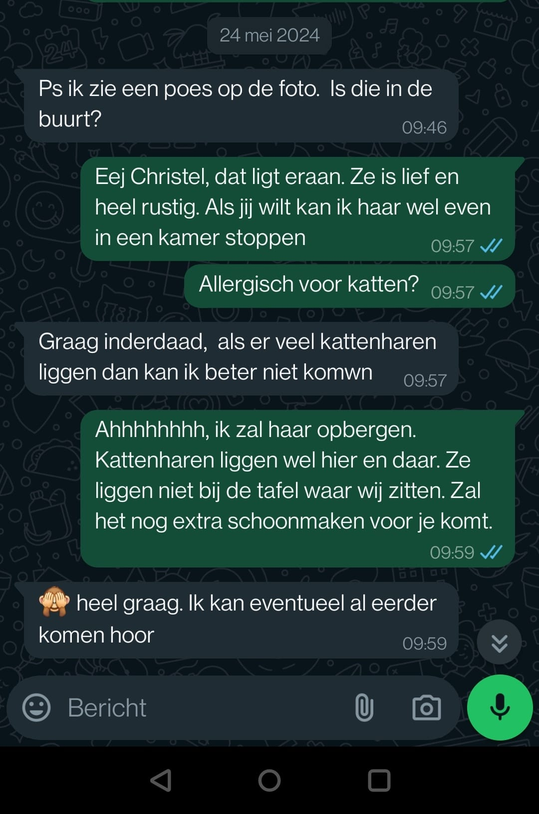

Een heel belangrijk iemand voor mij, Isabella. Mijn kat. Sommige hebben haar al gezien en sommige niet. Toch wil ik even stil staan bij deze lieve viervoeter.

## Wat haar ideaal maakt

Ze is een hele lieve kat die ook nog eens geluidloos is. echt iets wat handig is bij het helpen van jou. Je krijgt namelijk liefde van haar en ze leidt je ook nog eens niet af bij je verhaal.

Ze is ook open naar mensen en via haar kun je goed zien hoe het met je gaat. Als je energie afstotend is zal zij niet naderen en op afstand blijven. Ben je open, gevuld met levensenergie en sta je open voor haar dan zal ze je benaderen en nieuwsgierig zijn.

De kat laat dus op haar manier heel puur zien hoe jij bent. 

Btw: Als ze slaapt wilt dat gewoon zeggen dat ze moe is, verder niets 🤣.

## Wat wij dus niet meer gaan doen

Niet lang geleden was er een klant die echt letterlijk net voor haar afspraak dit vroeg "Is die in de buurt?". Zie foto hieronder voor bewijsmateriaal.

Ik voelde hem al aankomen natuurlijk maar gaf antwoord. Zij reageerde en gaf aan dat ze niets van katten moet hebben en niet kan komen als de kat aanwezig is. Ik natuurlijk een beetje in paniek, maar oké, het is voor 1 uur. Het voelde alleen helemaal niet goed. Dus net voordat de klant kwam heb ik de kat in de wc gestopt zodat ze niet zou gaan rondlopen tijdens de sessie. 

Isabella voelde het aankomen. Ik pakte haar op en liet haar los in de wc. Zij sprong meteen de wc uit.... Het voelde toen helemaal niet goed. Toch ging ik door en stopte ik haar weer in de wc. dit keer met tijdnood. Ik moest moeite doen want zij wilde eruit alsof ik haar in de grot wilde gooien. Ze gooide haar lichaam tegen de grond en begon haar klauwen te gebruiken als ankers zoals een berg klimmer. Aan het begin van de sessie huilde ze ook zoals katten dat doen.

Het voelde heel slecht.....

De klant gaf bij het begin van de sessie aan dat ze bang is van katten en alleen al kattenharen haar een onbehagelijk gevoel geven.

Ze hoorde wellicht niet het gejank van mijn kat in de badkamer 😢.

De sessie verliep prima en na 5 minuten stopte Isabella met miauwen. Ze liep ook gewoon rustig de wc uit. 
Maar toch hebben wij hier van geleerd. Wij gaan dit namelijk nooit meer doen. Hoe een Amerikaanse president het ooit zei zo zeg ik het ook over mijn kat. 

Stinky First!

Dus ben je helaas bang of heel erg allergisch voor katten dan kan ik je via een online meeting van dienst zijn. Bij mij op locatie kan wel, maar de kat is erbij en dat gaat ook niet veranderen. 

De kat was er namelijk eerst.

Zie hieronder voor het leuke filmpje van Isabella.

<iframe 
 width="560" height="315" src="https://www.youtube.com/embed/6ojp7UqiRn0" frameborder="0" allow="accelerometer; encrypted-media; gyroscope; picture-in-picture" allowfullscreen></iframe>

Het zou natuurlijk geweldig zijn als je toch durft te komen. Dan ben je namelijk verder dan de meeste.

Zoals je ook in het filmpje kan zien doet ze geen vlieg kwaad en is zij ideaal.

Je kan het 🙂.

Meld je aan voor de nieuwsbrief en blijf ook op de hoogte van Isabella! Ook krijg je het uitgewerkt Hoofdcentrum ongedefinieerd van Human Design dan van mij cadeau. Ga je leuk vinden. Echt wel.

## Conclusie

De kat is heilig en door vele geliefd.

Mocht je bang zijn voor de kat laat het mij dan weten. Dan kunnen wij daar rekening mee houden. Zo kunnen wij de sessie online houden. Het zou natuurlijk helemaal geweldig zijn als je je door je angst vecht en alsnog fysiek komt. Dan ben je al verder dan de meeste.

Zal het beste zijn voor jou als persoon.

De kat zal dus onder geen enkel beding opgesloten worden of bij slecht weer naar buiten gestuurd worden.

Verder wenst Isabella je nog een fijne dag.

## Wat andere ook lezen
<ul>
  <li>
    <a class="text-lg font-medium underline text-brand-copper hover:no-underline" href=../../de-manieren>De manieren
    </a>
  </li>
  <li>
    <a class="text-lg font-medium underline text-brand-copper hover:no-underline" href=../../persoonlijk/ik-heb-mijn-baan-opgezegd/>Ik heb mijn baan opgezegd!!!
    </a>
  </li>
</ul>