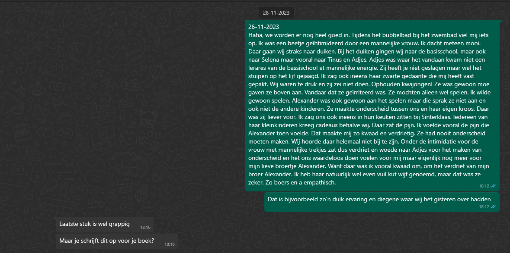

Niet iedereen weet van Progressive Mental Alignment (voortaan PMA genoemd in dit artikel) maar zelf vind ik het goud waard. Iedereen moet van PMA weten. Het geeft je namelijk de vishengel en laat je vissen naar je pure zelf. Je komt ineens te weten waarom je op bepaalde manieren op een bepaalde manier reageert.

Lees verder.

## PMA uitgelegd

PMA staat dus voor Progressive Mental Alignment en is bedacht door Joop Korthuis. Joop is onderzoeker, wetenschapper en holistisch geneeskundige. Dus dat is niet niets. Ook is hij de grondlegger van The Unified Brain Model wat ten grondslag ligt van PMA.

Zoals wij allemaal wel weten zitten psychosomatische klachten en saboterende denkpatronen allemaal in het onbewuste. Ons denken beïnvloed ons gevoel en zeker onze gezondheid. Met PMA kun je deze allemaal opsporen en jezelf helen. 

Het werkt als volgt:

Je brein neemt allemaal zaken waar en slaat deze op in je brein. Deze gebeurtenissen worden allemaal gecodeerd opgeslagen in je archief. Als er niets aan de hand is gaat dat goed. De verschillende bestanden zijn met elkaar verbonden en er is duidelijk waar het reukbestand te vinden is, het beeldbestand en alle andere bestanden. 

Het gaat alleen mis bij (hevige) angst en stress.

Dan wordt alles namelijk corrupt en wordt het niet op de juiste manier opgeslagen. Mijn eigen ervaring is dan ook dat de negatieve emoties van het gebeuren heel erg kleven aan de corrupte bestanden. 

Angst is daarom een fijne parameter. Dan weet je namelijk dat je de juiste richting inkijkt.

Doordat de cluster (verzameling van corrupte bestanden) is beschadigd kun je bij soortgelijke situaties niet goed meer bij de vorige bestanden en dat leidt tot kortsluiting. Het brein haalt namelijk altijd een referentiekader uit het archief bij een situatie. Deze kortsluiting voel je in je lichaam. Je voelt bijvoorbeeld een steek in je buik als je iemand ziet met dezelfde soort jas of voelt spanning rond je handen als iemand hetzelfde gedrag toont als de persoon in de badcluster.

Let op! 

Wij hebben het hier over lichamelijke sensatie(s) in je lichaam en niet perse over gevoel. Dit gevoel is een afgeleide van je lichamelijke sensaties. Jij maakt er gevoel van, maar dat is een invulling van jou en niet hetgeen wat er perse tot toe. Tenminste niet op dit vlak.

Wanneer je merkt dat je bij bepaalde situaties veel last ervaart in de situatie, of ervoor of ernaar, dan weet je dat je in de buurt zit van een bad cluster. Weet dat je ego en je verdedigingsmechanisme niet willen dat je daar naar toe gaan, dus die gaan er alles aan doen om de boel te saboteren. Gewoon negeren en het komt goed.

Je zal door het opsporen van de badclusters een nieuw mens worden en vele nieuwe inzichten krijgen.

Lees volgende alinea voor een voorbeeld van mijzelf. Dan zal het allemaal duidelijk worden.

## Een voorbeeld van mij

Het was zondag 26 november 2023 dat ik weer een bad cluster had gevonden.

Tijdens het bubbelbad bij het zwembad raakte ik een beetje geïntimideerd door een mannelijke vrouw. Ik voelde angst, boosheid, irritatie en noem maar op. De sensatie, wat de sleutel is, voelde ik in mijn buik en was een drukkend gevoel rechts van mijn navel. Ik dacht meteen “mooi, daar kunnen wij dan thuis naar duiken”. 

Het is namelijk niet de 1e badcluster die ik wil opsporen en opschonen.

Ook weet ik dat het niet die vrouw is. Iets in mij haakt eraan. De vrouw en ik keken elkaar vies aan.

Thuis gingen wij ons focussen op die sensatie en gingen wij duiken. Zo noem ik dat dan.

Bij het duiken gingen wij naar de basisschool, maar ook naar Selena maar vooral naar Tinus en Adjes. Adjes was waar het vandaan kwam niet een lerares van de bassischool met mannelijke energie. 

“Zij heeft je niet geslagen maar wel het stuipen op het lijf gejaagd.” Is hetgeen wat ik doorkreeg. Nou mooi, dat scheelt 😆.

Ik zag ook ineens haar zwarte gedaante die mij heeft vast gepakt. Wij waren te druk en zij zei "Niet doen. Ophouden kwajongen!" Ze was gewoon moe gaven ze boven aan. Vandaar dat ze geïrriteerd was. Ze mochten alleen wel spelen. Ik wilde gewoon spelen. Alexander was ook gewoon aan het spelen maar die sprak ze niet aan en ook niet de andere kinderen. Ze maakte onderscheid tussen ons en haar eigen kroos. Daar was zij liever voor. 

Ik zag ons ook ineens in hun keuken zitten bij Sinterklaas. Iedereen van haar kleinkinderen kreeg cadeaus behalve wij. Daar zat de pijn. Ik voelde vooral de pijn die Alexander toen voelde. Dat maakte mij zo kwaad en verdrietig. Ze had nooit onderscheid moeten maken. Wij hoorde daar helemaal niet bij te zijn. 

Onder de intimidatie voor de vrouw met mannelijke trekjes zat dus verdriet en woede naar Adjes voor het maken van onderscheid en het ons waardeloos doen voelen. Het verdriet en woede was voor mij maar eigenlijk nog meer voor mijn lieve broertje Alexander. Want daar was ik vooral kwaad om, om het verdriet van mijn broer Alexander. Ik heb haar natuurlijk wel even vuil kut wijf genoemd, maar dat was ze zeker. Zo boers en a empathisch.

Zie hier de reactie van mijn broer via Whatsapp.

PMA gebruiken kan dus ook zeker wel iets geinigs hebben.

Wij moeten er namelijk beide wel om lachen 😜.

## Waarom ik denk dat het veel waard is

Zoals je uit mijn voorbeeld kunt halen weet ik nu waarom ik écht geïrriteerd en geïntimideerd was om die vrouw. Zoals je ziet zit het niet bij die vrouw, maar bij de persoon/situatie uit het verleden. Daar is de haak ontstaan. 

De vrouw bij het zwembad had gewoon een gelijksoortig overkomen waardoor ik gemengde negatieve emoties ervaarde bij het zien van haar. Een mannelijke vrouw. Ofja, een vrouw met veel mannelijke energie.

Dit is ook precies de reden dat iedereen van PMA dient te weten. Eigenlijk reageert iedereen vanuit zijn oud zeer. Ze dienen niet te reageren vanuit pijn en zich bot te vieren op anderen maar zichzelf te onderzoeken. 

Trek verbanden en je komt er wel.

Zo zorg je net als mij ervoor dat je erachter komt waarom je op bepaalde manieren reageert in bepaalde situaties en/of soorten mensen.

Heel jezelf.

Wees ook lief voor jezelf. Je kan er namelijk niets aan doen. Je kiest namelijk niet voor je badclusters/trauma’s.
Het mooie aan deze methode is dat je zelf leert vissen. Je hebt namelijk niemand nodig. Je hoeft enkel de basis te leren en jezelf voelen, maar dan ook echt voelen. 

p.s. Er zal altijd wat residu blijven hangen naar je oude demonen, maar weet dat het stukken minder is en je het nu ook veel meer in de hand hebt.

Je ego zal af en toe proberen weer controle te krijgen dus die probeert de haak weer terug te plaatsen. Maar die moet je gewoon negeren. Eigenlijk altijd wel. Ook al is dat heel lastig soms.

Je ego en zelfverdedigingsmechanisme zullen ook af en toe de haak terug willen plaatsen en er heel veel aandacht aan schenken om je af te leiden voor andere haken. Hoe meer haken jij wegneemt hoe meer zij hun best doen om de andere haken te camoufleren of weg te moffelen. Weet dat en je zal steeds dieper in jezelf kunnen komen en steeds meer thuis komen.
Want daar gaat het om. 

Thuis komen.

Zie hieronder voor het filmpje over PMA. Wellicht vind je video fijner dan geschreven tekst.

<iframe 
 width="560" height="315" src="https://www.youtube.com/embed/4KAGQZ0Zp48?si=WQJF86jav_zVU9Br" frameborder="0" allow="accelerometer; encrypted-media; gyroscope; picture-in-picture" allowfullscreen></iframe>

## Conclusie

PMA is mooi.

PMA is van overleven naar leven gaan en echt leven zoals je diepste kern wilt. 

Je wilt niet meer gebukt gaan onder het verleden maar wilt je echte kleuren kennen en deze stralen.

Je wilt de echte jou zijn.

Door bewust te worden van jou eigen patronen en de bijbehorende sensaties in je eigen lichaam op dat moment zul je dichterbij jezelf komen. Door er vervolgens naar te duiken en vragen te stellen aan jezelf zal je ze oplossen. Doordat je ze vervolgens hebt gevonden zal veel oud zeer naar boven komen en zullen de badclusters weer schoongemaakt worden. De bestanden worden gereinigd en veroorzaken niet meer zoveel pijn. 

je heelt.

Voor al dit zorgt PMA. PMA is zo mooi omdat het je ook laat inzien waarom je bij bepaalde gebeurtenissen en/of personen getriggerd wordt. Het geeft je hiermee ook vele wijsheden. Je wordt zachter voor jezelf. Je zal ook zachter worden naar anderen en steeds beter conditionering begrijpen. Het ego en je verdedigingsmechanisme leer je hiermee ook kennen. 

Ook zal je angst steeds beter een plek kunnen geven in plaats van het je leven laten dicteren. Je leert namelijk zelf vissen in plaats van elke keer maar naar een ander gaan als je even vastloopt. Als je van een ander afhankelijk blijft zul je in mijn ogen nooit goed met je angst om kunnen gaan. Daar ben ik van overtuigd. Dat is in mijn ogen ook heeeeeel waardevol van PMA. Je blijft daarin de beschikking houden. Je zal ook steeds beter angst kunnen herkennen bij anderen. 

Als je eenmaal weet hoe het werkt zal je snel gaan. Ook kun je anderen hiermee helpen. Het is helemaal geen hogere wiskunde. 

Jij en anderen kunnen het echt wel.

Je ogen zullen steeds helderder gaan stralen.

Ze zullen door personen heen kijken.

Ze gaan naar de ziel.

Jij gaat.

Mocht je nog vragen hebben over PMA of wil jij een afspraak plannen, dan kun je mij appen op +31 6 39556179 of mailen naar info@dekernmetjordi.com.

<a
              class="small-caps block mb-4 py-4 text-lg text-center font-medium leading-normal rounded gradient-btn no-underline"
              href="https://calendar.app.google/oHow2Z6mhSpUVwQUA"
              >Mijzelf schoonmaken</a
            >

## Wat andere ook lezen
<ul>
  <li>
    <a class="text-lg font-medium underline text-brand-copper hover:no-underline" href=../../de-manieren>De manieren
    </a>
  </li>
  <li>
    <a class="text-lg font-medium underline text-brand-copper hover:no-underline" href=../../reiki/wat-is-reiki/>Wat is Reiki
    </a>
  </li>
</ul>