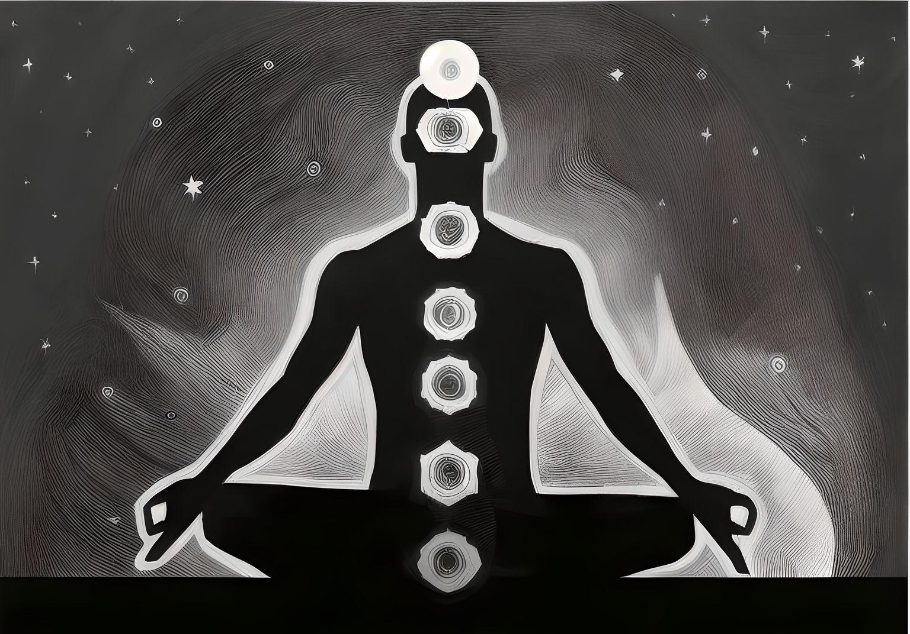

In dit artikel zal uitgelegd worden wat Reiki is, zijn geschiedenis, werking en samenhang tussen de chakra gebieden en het lichaam en geest. Zo weet je (nog) beter wat de behandelmethode Reiki is die wordt toegepast door mij bij De kern met Jordi.

## Betekenis Reiki

Reiki is een Japans woord en wordt uitgesproken als "Ray-Key". Rei wordt gedefinieerd als het "universele leven" en Ki betekent "energie". Tezamen betekent Reiki dus universele levensenergie.

## Geschiedenis

Reiki heeft een hele mooie geschiedenis. De geneeskunde van Reiki is namelijk in het begin van de 19e eeuw door Dhr. Mikao Usui herontdekt. Ja, je leest het goed, het is dus niet bedacht maar herontdekt. Mikao Usui was een Boeddhist die geïntereseerd was in de genezing van Geest en Lichaam. Hij bekeek alles dus al holistisch. Hij was vooral op zoek naar het geheim van het genezen van zieken door handopleggingen zoals Boeddha en Jezus. Hij wist gewoon dat als het eerder gedaan was het opnieuw gedaan kon worden. Gelijk had hij en dit bedoelde ik met herontdekken.

Na vele omzwervingen buiten Japan kwam hij op een gegeven moment terug naar Japan. Hij raakte verder geïnteresseerd in Boeddha en had daardoor vele Boeddhistische kloosters bezocht. De monniken gaven elke keer aan dat zij bezig zijn met het genezen van de geest. Het lichaam is van ondergeschikte belang. Uiteindelijk besloot hij ook bij een klooster te blijven waar een oude abt het met hem eens was. Het moet mogelijk zijn. Hij bestudeerde de Boeddhistisch geschriften en Soetra's (Soetra's zijn kernachtige spreuken die bepaalde hogere wijsheden en vermogens omvatten). Na lang zoeken vond Dhr. Usui wat hij zocht in de Sankriet Soetra's. In de leringen van Boeddha ontdekte hij formules en symbolen en de beschrijvingen hoe Boeddha kon genezen. Hij had dan wel de kennis herontdekt, maar deze kon hij niet tot uitvoering brengen. Hij was daarover natuurlijk gefrustreerd.

Hij besprak zijn probleem met zijn vriend de oude abt. Die adviseerde hem naar de heilige berg Kuriyama te gaan om daar 21 dagen te mediteren en te vasten om zo in contact te kunnen komen met het niveau van de symbolen en de kracht van het genezen te ontvangen. Dhr. Usui ging de volgende dag op weg en beklom de berg Kuriyama. Hij legde 21 steentjes voor zich neer en schoof elke dag een steentje weg. Er gebeurde niets en hij voelde zijn krachten opraken.

Op de 21e dag was het dan eindelijk daar. Hij werd zich plotseling bewust van een stralend pulserend licht dat vanuit de hemel heel snel naar hem toe kwam. Het werd steeds groter, Dhr. Usui werd bang en wilde opstaan en wegrennen. Uiteindelijk drong het tot hem door dat het een of ander teken moest zijn.

Het licht trof hem in het midden van zijn voorhoofd, als in luchtbellen zag hij de symbolen die hij tijdens zijn studie ontdekt had. De sleutel tot genezen, zoals Boeddha en Jezus het hadden gedaan. Het leek wel of de symbolen in zijn geheugen branden. Toen Dhr. Usui bijkwam en de trance over was, voelde hij zich niet langer uitgeput. Ook zijn stijfheid en het gevoel van honger van de vorige dagen waren verdwenen. Hij verbaasde zich, dat hij over zoveel kracht beschikte en zich zo verjongd voelde. Dit was het eerste wonder van die morgen en vele wonderen volgde.

Dit was dus het begin van Reiki en heeft veel moois gebracht. Later heeft Dhr. Usui studenten aangenomen en die hebben de leer voortgebracht aan andere. De rest is geschiedenis en op dit moment is Reiki bekend over heel de wereld en heeft het al vele mensen geholpen met allemaal onverklaarbare kwaaltjes en ditjes.

## Werking

Laten wij ook niet het belangrijkste vergeten. Nu weet je wel wat de betekenis is van Reiki en zijn geschiedenis, je wilt natuurlijk ook nog weten hoe het werkt.

Het werkt door als behandelaar de universele energie door te geven aan jouw, diegene die wordt behandelt. De behandelaar is met niets anders bezig dan het doorgeven van de energie en geeft daarin niet zijn eigen energie mee.

Dit wordt gedaan door handopleggingen op diverse lichaamsdelen toe te passen. Deze zijn vooral gefocust op de 7 chakra posities in ons allemaal.

Als eerste gaat de behandelaar achter je staan en contact maken met je energieveld. Vervolgens zal ik als behandelaar intuïtief naar de plekken gaan die het meeste de universele energie nodig hebben. Soms wordt tijdens de behandeling al iets besproken en soms helemaal niets. Dan worden de bevindingen besproken na de behandeling.

Het kan zijn dat jij tijdens de behandeling ook zaken ervaart en dat is alleen mooi meegenomen.

Door de chakra punten met Reiki te voeden zullen blokkades opgeheven worden en zal je fysiek, emotioneel, mentaal en spiritueel verbeteren. De natuurlijke helende kracht van het lichaam kan dan zijn werk gaan doen.

Dit zal helemaal gebeuren wanneer wij datgene wat wij hebben ervaren tijdens de behandeling na de behandeling bespreken. De chakra's die worden behandelt tijdens de behandeling hebben ook een symbolische betekenis en de blokkades zeggen veel over de persoon in kwestie.

## De samenhang tussen de chakra gebieden en lichaam en geest

Zoals hierboven al kort is aangehaald zeggen de (geblokkeerde) chakra gebieden veel over de persoon die wordt behandelt.

De 7 chakra's zijn namelijk verbonden met het welzijn van de persoon.

Ik zal ze hier niet allemaal benoemen, maar geef je wel wat voorbeelden.

Komt naar de sessie bijvoorbeeld naar boven dat je keelchakra extra aandacht nodig heeft en voel jij ook tijdens, of daarvoor al, je keel dan kan het wijzen op communicatie. De keelchakra staat namelijk voor communicatie en het kan wellicht aangeven dat jij je zegje niet durft te doen en je dus niet durft te uiten. De Reiki zal dan extra daarnaartoe stromen om de blokkade op te heven.

Het kan ook zijn dat bij jou juist de kroonchakra meer aandacht vraagt. Als jij namelijk minder goed slaapt is dat vaak te wijten aan een kroon chakra welke uit balans is.

Het kan natuurlijk ook zijn dat bij jou niet grote kwalen aanwezig zijn en je tijdens de sessie niet iets nadrukkelijk voelt. Dat is alleen maar mooi, dan is het bij jou al (bijna) goed in balans en zal de Reiki alles alleen versterken en zal je tijdens de sessie ook goed de rust ervaren die in ons allemaal schuilt.

## Samenvatting

Zo.

Hopelijk is nou alles inzake Reiki voor je duidelijk.

Reiki is dus een heel mooi iets. Het woord komt uit het Japans en betekent universele levensenergie. De geschiedenis is heel mooi en begon dus bij Dhr. Usui die heel graag wilde weten hoe Boeddha en Jezus hun wonderde verrichten. Na lang zoeken en 21 dagen mediteren op de berg Kuriyama heeft hij het allemaal doorgekregen en de rest is geschiedenis. Je hebt ook in deze artikel gelezen over de werking en weet nu hoe een behandeling van A tot Z werkt. Je hebt ook geleerd dat de pijnpunten van het lichaam gelinkt zijn aan de diverse chakra's.

Het belangrijkste is gewoon om te onthouden dat Reiki iets heel moois is. Het brengt je lichaam in balans op een liefdevolle en zachte manier. De Reiki stroomt waar het hoort te stromen en zet de natuurlijke genezende kracht van het lichaam weer aan.

Reiki is iets wat wij allemaal nodig hebben.

Mocht je nog vragen hebben over Reiki of wil jij een afspraak plannen, dan kun je mij appen op +31 6 39556179 of mailen naar [info@dekernmetjordi.com](mailto:info@dekernmetjordi.com).

Tot snel!

<a
              class="small-caps block mb-4 py-4 text-lg text-center font-medium leading-normal rounded gradient-btn no-underline"
              href="https://calendar.app.google/oHow2Z6mhSpUVwQUA"
              >Maak een afspraak</a
            >

## Wat andere ook lezen
<!-- - [De manieren](../de-manieren) -->
<ul>
  <li>
    <a class="text-lg font-medium underline text-brand-copper hover:no-underline" href=../../de-manieren>De manieren
    </a>
  </li>
</ul>
